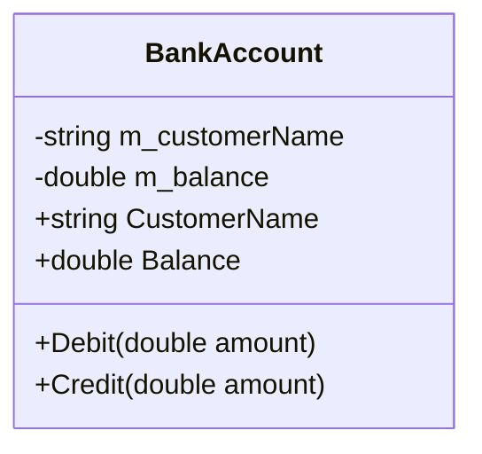

```mermaid
classDiagram
    class BankAccount {
        -string m_customerName
        -double m_balance
        +string CustomerName
        +double Balance
        +Debit(double amount)
        +Credit(double amount)
    }
```
